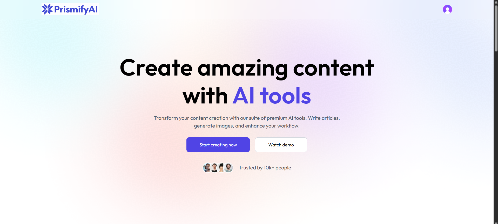
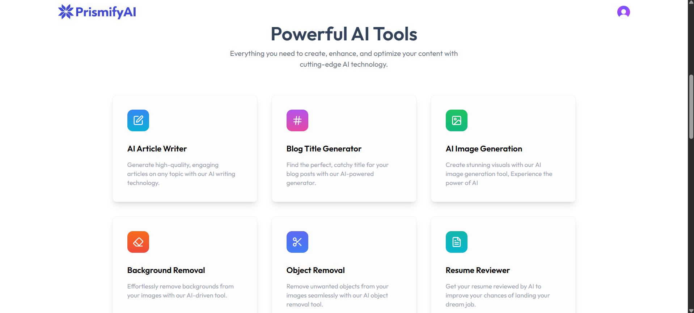
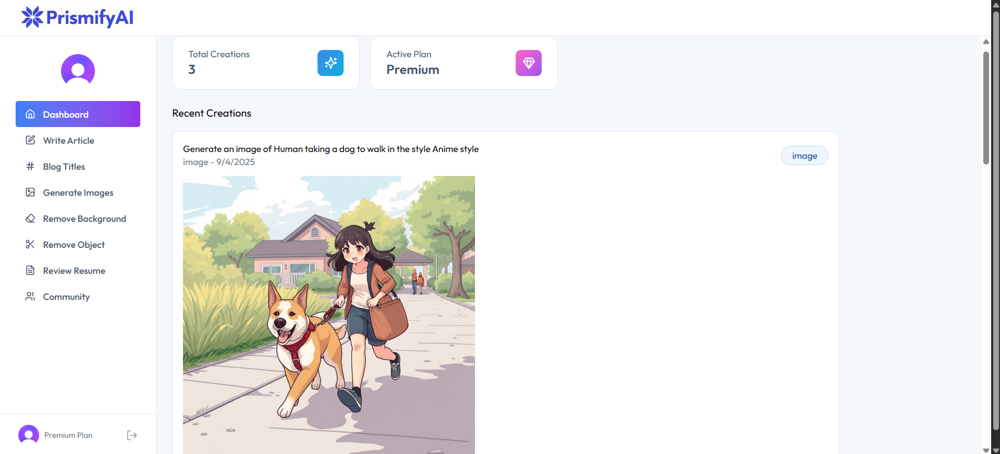
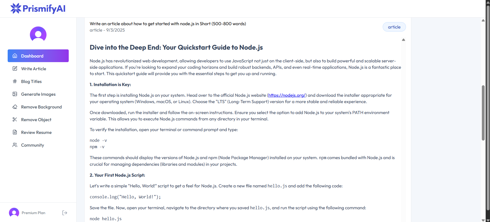

# PrismifyAI - The Spectrum of Creation with AI

##  Welcome to the Future of Creative Content

PrismifyAI is your all-in-one AI toolkit for writing compelling articles, generating stunning visuals, and bringing your creative ideas to life.

## 📸 Project Showcase

###  Main Landing Page

*Experience the sleek and intuitive interface of PrismifyAI*

### 🛠️ Six Powerful Tools at Your Fingertips

*Discover all six creative tools designed to supercharge your content creation*

###  Tools in Action


*See PrismifyAI's powerful features working seamlessly together*

##  Key Features

🏠 **Dashboard** - Centralized hub to access all your creative tools and track your projects

✍️ **Write Article** - Generate high-quality, SEO-optimized articles using advanced AI technology

📝 **Blog Titles** - Create catchy, engaging blog titles that drive clicks and improve your content strategy

🎨 **Generate Images** - Transform text prompts into stunning visuals using state-of-the-art AI image generation

🖼️ **Remove Background** - Instantly remove backgrounds from any image with professional precision

✂️ **Remove Object** - Seamlessly eliminate unwanted objects from photos while maintaining image quality

📄 **Review Resume** - Get AI-powered feedback and suggestions to enhance your resume and boost career prospects

👥 **Community** - Connect with other creators, share insights, and collaborate on projects

## 🛠 Technology Stack

- **Frontend**: React.js with Vite
- **Backend**: Node.js with Express.js
- **Database**: PostgreSQL (Neon.tech)
- **Authentication**: Clerk
- **AI Content**: Google Gemini API
- **Image Processing**: Clipdrop API
- **Image Storage**: Cloudinary
- **Deployment**: Vercel/Netlify (Frontend) + Railway/Render (Backend)

##  Getting Started

### Prerequisites
- Node.js (v18 or higher)
- npm or yarn package manager
- Git

### Installation

1. **Clone the repository**
   ```bash
   git clone https://github.com/your-username/prismifyai.git
   cd prismifyai
   ```

2. **Install dependencies**
   
   For the client (React):
   ```bash
   cd client
   npm install
   ```
   
   For the server (Node.js):
   ```bash
   cd server
   npm install
   ```

3. **Environment Configuration**
   
   Create `.env` file in the **server** directory:
   ```env
   # Server Configuration
   PORT=3000
   NODE_ENV=development
   
   # Neon Database
   DATABASE_URL=your_neon_database_connection_string
   
   # Clerk Authentication
   CLERK_PUBLISHABLE_KEY=pk_test_your_clerk_publishable_key
   CLERK_SECRET_KEY=sk_test_your_clerk_secret_key
   
   # Google Gemini AI
   GOOGLE_GEMINI_API_KEY=your_google_gemini_api_key
   
   # Clipdrop API
   CLIPDROP_API_KEY=your_clipdrop_api_key
   
   # Cloudinary
   CLOUDINARY_CLOUD_NAME=your_cloudinary_cloud_name
   CLOUDINARY_API_KEY=your_cloudinary_api_key
   CLOUDINARY_API_SECRET=your_cloudinary_api_secret
   ```
   
   Create `.env` file in the **client** directory:
   ```env
   # Vite React App
   VITE_CLERK_PUBLISHABLE_KEY=pk_test_your_clerk_publishable_key
   VITE_BASE_URL=http://localhost:3000
   ```

4. **Database Setup**
   ```bash
   cd server
   npm run migrate
   npm run seed
   ```

5. **Start the development servers**
   
   Start the backend server:
   ```bash
   cd server
   npm run dev
   ```
   
   Start the frontend (in a new terminal):
   ```bash
   cd client
   npm run dev
   ```

6. **Open your browser**
   
   Navigate to `http://localhost:5173` to see PrismifyAI in action.

## 🎯 Why Choose PrismifyAI?

- **Complete Creative Suite**: Six powerful AI tools in one platform
- **User-Friendly Interface**: Intuitive design that makes AI accessible to everyone
- **Professional Results**: Enterprise-grade AI technology for high-quality output
- **Community Driven**: Connect and collaborate with fellow creators
- **Scalable Architecture**: Built to grow with your creative needs

## 🤝 Contributing

We welcome contributions from the community! Here's how you can help:

1. Fork the repository
2. Create your feature branch (`git checkout -b feature/amazing-feature`)
3. Commit your changes (`git commit -m 'Add some amazing feature'`)
4. Push to the branch (`git push origin feature/amazing-feature`)
5. Open a Pull Request

## 📋 Roadmap

- [ ] Advanced AI model integration
- [ ] Real-time collaboration features
- [ ] Mobile application development
- [ ] API marketplace for third-party integrations
- [ ] Advanced analytics and insights

## 📄 License

This project is licensed under the MIT License - see the [LICENSE](LICENSE) file for details.

---

<div align="center">
  <strong>Developed by tgb100</strong>
  <br>
  <em>Unleashing creativity through the spectrum of AI</em>
</div>
